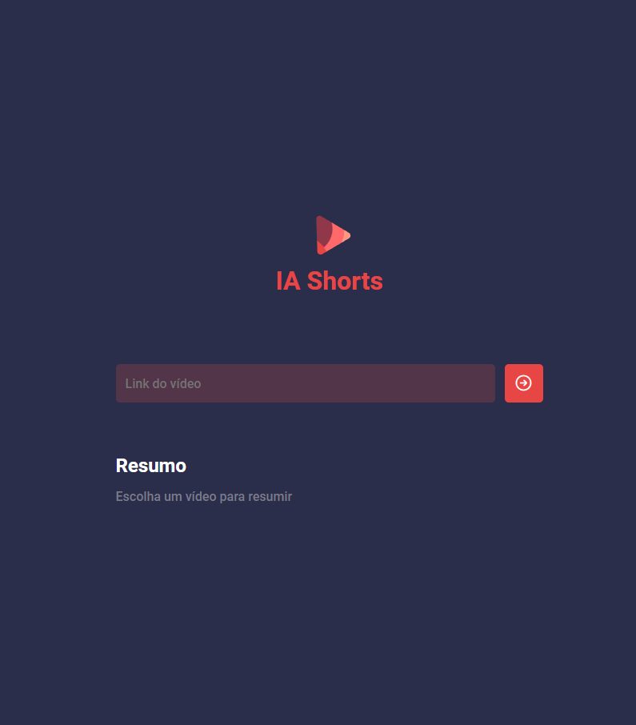

<p align="center">

</p>
<h1 align="center">Summary Shorts</h1>

### 🏠 [Homepage](https://https://github.com/CharlesVeronezi)

## 🎉 Start server

Open two terminals, in the first one you will run the command:

```sh
npm run server
```

In the second:

```sh
npm run web
```

## 🔥 Usage

To use it, simply open localhost in your browser on port 5173 and then enter the URL.

## ⚙️ Mode

To perform only the audio transcription without the summary, simply modify line 30 of `form.js` to:

```sh
content.textContent = transcription.data.result
```

And comment out the block:

```sh
const summary = await server.post("/summary", {
    text: transcription.data.result,
})
```

## 💻 Project

"Summary Shorts transcribes and summarizes videos from a link. Currently, the project only summarizes and transcribes 'Short' videos from YouTube. This is an adaptation of the project created during the NLW AI event by Rocketseat."

## 👨🏾‍💻 Techs

- Javascript
- HTML
- CSS
- Node.js

## 📝 Licença

This project is under the MIT license.
